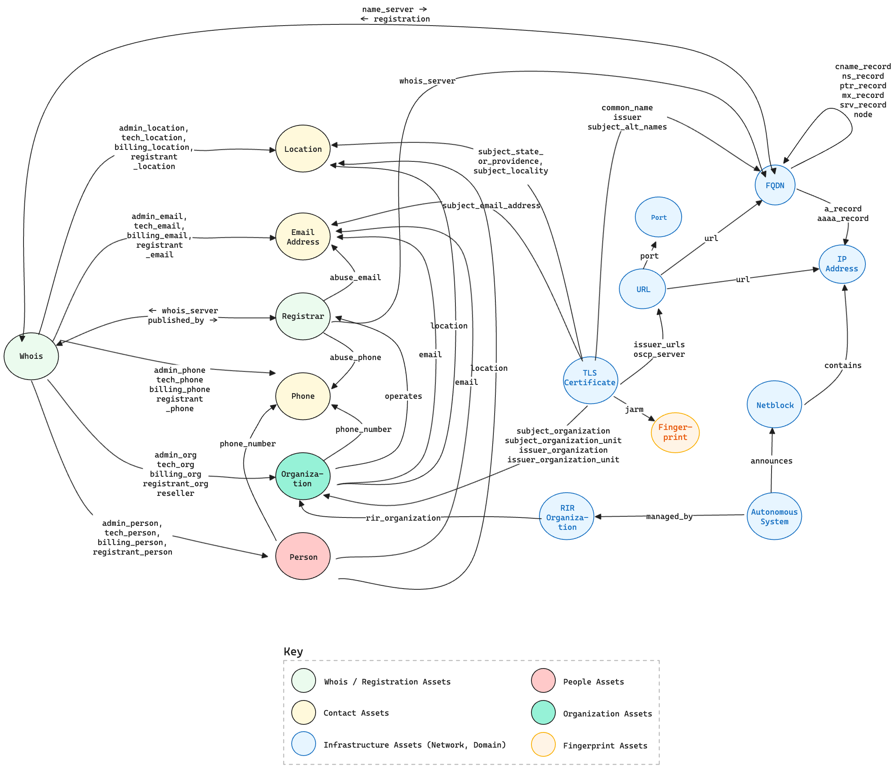

# Open Asset Model Specification

## Goals

The Open Asset Model is an effort to uniformly describe assets
that belong to both organizations and individuals.

Asset specifications have traditionally focused upon the technical,
infrastructure-specific things that can be discovered on the internet.
While this represents a potentially significant portion of an organization's
assets, it is also limiting. The Open Asset Model seeks to expand on
this and cover the breadth and depth of both physical and digital assets
so that an organization can realize their full Attack Surface.

Open Asset Model defines not just the assets themselves, but also the
relationships within and across types of assets. This allows the model
to express the real-world interconnectedness that exists between assets.

Open Asset Model also seeks to provide models to support the [discovery path][w3c-provenance]
to understand how assets were discovered / exposed.

When it comes to asset discovery, it is sometimes a bit of a mystery as to
how an asset was discovered. For this reason, we believe it is necessary to
to record the order of events, including the source,
that lead to the discovery of an asset.

The source of the data is useful in a number of different ways:

* It can help understand the trustworthiness and/or accuracy of the data provided.
  Data sourced from less trusted sources may need to go through additional
  validation steps before it can be used.
* It can inform whether the data can be transferred with other parties,
  which is especially important in meeting modern data privacy requirements.
* It explain how a disputed asset was discovered during an investigation.


[View Image](./images/taxonmy.excalidraw.png)

## Asset Taxonomy

### Contact Assets

#### Email Address

| Property | Type | Required | Description |
| -------- | ---- | -------- | ----------- |
| `address` | string | true | The full email address |
| `local` | string | false | The local part of the email address |
| `domain` | string | false | The part of the address after the @ symbol |

###### Outgoing Relationships

No outgoing relationships

###### Incoming Relationships

| Relationship | Type |
| ------------ | ---- |
| `admin_email` | [`Whois`](#whois) |
| `tech_email` | [`Whois`](#whois) |
| `billing_email` | [`Whois`](#whois) |
| `registrant_email` | [`Whois`](#whois) |
| `email` | [`Person`](#person) |
| `email` | [`Organization`](#organization) |
| `abuse_email` | [`Registrar`](#registrar) |
| `subject_email_address` | [`TLSCertificate`](#tls-certificate) |

#### Location

| Property | Type | Required | Description |
| -------- | ---- | -------- | ----------- |
| `formatted_address` | string | false | The formatted address |
| `building_number` | string | false | the number of the building at the location |
| `street_name` | string | false | the name of the street at the location |
| `unit` | string | false | the unit number at the location |
| `building` | string | false | the name of the building at the location |
| `town` | string | false | the name town or city at the location |
| `locality` | string | false | the locality at the location |
| `region` | string | false | the name of the region or state at the location |
| `country_code` | string | false | the ISO 3166-1 alpha-2 country code |
| `postal_code` | string | false | the postal code at the location |

##### Outgoing Relationships

No outgoing relationships

##### Incoming Relationships

| Relationship | Type |
| ------------ | ---- |
| `admin_location` | [`Whois`](#whois) |
| `tech_location` | [`Whois`](#whois) |
| `billing_location` | [`Whois`](#whois) |
| `registrant_location` | [`Whois`](#whois) |
| `location` | [`Person`](#person) |
| `location` | [`Organization`](#organization) |
| `subject_state_or_province` | [`TLSCertificate`](#tls-certificate) |
| `subject_locality` | [`TLSCertificate`](#tls-certificate) |

#### Phone

| Property | Type | Required | Description |
| -------- | ---- | -------- | ----------- |
| `type` | string | false | The type of phone number |
| `raw` | string | true | The raw phone number |
| `e164` | string | false | The E.164 formatted phone number |
| `country_abbrev` | string | false | The ISO 3166-1 alpha-2 country code |
| `country_code` | string | false | The ISO 3166-1 numeric country code |
| `subscriber_number` | string | false | The subscriber number |
| `ext` | string | false | The extension of the phone number |

##### Outgoing Relationships

No outgoing relationships

##### Incoming Relationships

| Relationship | Type |
| ------------ | ---- |
| `admin_phone` | [`Whois`](#whois) |
| `tech_phone` | [`Whois`](#whois) |
| `billing_phone` | [`Whois`](#whois) |
| `registrant_phone` | [`Whois`](#whois) |
| `phone_number` | [`Person`](#person) |
| `phone_number` | [`Organization`](#organization) |
| `abuse_phone` | [`Registrar`](#registrar) |

---

### Domain Assets

#### FQDN

| Property | Type | Required | Description |
| -------- | ---- | -------- | ----------- |
| `name` | string | true | Fully Qualified Domain Name |

##### Outgoing Relationships

| Relationships | Type |
| -------- | ---- |
| `a_record` | [`IPAddress`](#ip-address) |
| `aaaa_record` | [`IPAddress`](#ip-address) |
| `cname_record` | [`FQDN`](#fqdn) |
| `ns_record` | [`FQDN`](#fqdn) |
| `ptr_record` | [`FQDN`](#fqdn) |
| `mx_record` | [`FQDN`](#fqdn) |
| `srv_record` | [`FQDN`](#fqdn) |
| `node` | [`FQDN`](#fqdn) |
| `registration` | [`Whois`](#whois) |

##### Incoming Relationships

| Relationship | Type |
| ------------ | ---- |
| `cname_record` | [`FQDN`](#fqdn) |
| `ns_record` | [`FQDN`](#fqdn) |
| `ptr_record` | [`FQDN`](#fqdn) |
| `mx_record` | [`FQDN`](#fqdn) |
| `srv_record` | [`FQDN`](#fqdn) |
| `node` | [`FQDN`](#fqdn) |
| `whois_server` | [`Registrar`](#registrar) |
| `name_server` | [`Whois`](#whois) |
| `common_name` | [`TLSCertificate`](#tls-certificate) |
| `subject_alt_names` | [`TLSCertificate`](#tls-certificate) |
| `ip_address` | [`URL`](#url) |

---

### Fingerprint Assets

#### Fingerprint

| Property | Type | Required | Description |
| -------- | ---- | -------- | ----------- |
| `type` | string | true | The type of fingerprint |
| `value` | string | true | The value of the fingerprint |

##### Outgoing Relationships

| Relationship | Type |
| ------------ | ---- |
| `jarm` | [`TLSCertificate`](#tlscertificate) |

##### Incoming Relationships

No Incoming Relationships

---

### Network Assets

#### AutonomousSystem

| Property | Type | Required | Description |
| -------- | ---- | -------- | ----------- |
| `number` | int | true | Autonomous System Number |

##### Outgoing Relationships

| Relationship | Type |
| ------------ | ---- |
| `announces` | [`Netblock`](#netblock) |
| `managed_by` | [`RIROrganization`](#rirorganization) |

##### Incoming Relationships

No incoming relationships

#### IP Address

| Property | Type | Required | Description |
| -------- | ---- | -------- | ----------- |
| `address` | object | true | Network address |
| `type` | string | true | IPv4 or IPv6 |

##### Outgoing Relationships

| Relationship | Type |
| ------------ | ---- |
| `port` | [`Port`](#port) |


##### Incoming Relationships

| Relationship | Type |
| ------------ | ---- |
| `a_record` | [`FQDN`](#fqdn) |
| `aaaa_record` | [`FQDN`](#fqdn) |
| `contains` | [`Netblock`](#netblock) |
| `ip_address` | [`URL`](#url) |

#### Netblock

| Property | Type | Required | Description |
| -------- | ---- | -------- | ----------- |
| `cidr` | object | true | CIDR representation of an  IP block |
| `type` | string | true | IPv4 or IPv6 |

##### Outgoing Relationships

| Relationship | Type |
| ------------ | ---- |
| `contains` | [`IPAddress`](#ip-address) |

##### Incoming Relationships

| Relationship | Type |
| ------------ | ---- |
| `announces` | [`AutonomousSystem`](#autonomoussystem) |

#### Port

| Property | Type | Required | Description |
| -------- | ---- | -------- | ----------- |
| `port` | int | true | Port number |
| `protocol` | string | true | TCP or UDP |

##### Outgoing Relationships

No Outgoing Relationships

##### Incoming Relationships

| Relationship | Type |
| ------------ | ---- |
| `port` | [`URL`](#url) |

#### RIROrganization

| Property | Type | Required | Description |
| -------- | ---- | -------- | ----------- |
| `name` | string | true | Organization Name |
| `rir_id` | string | false | unique identifier of the RIR organization |
| `rir` | string | false | Regional Internet Registry |

##### Outgoing Relationships

No outgoing relationships

##### Incoming Relationships

| Relationship | Type |
| ------------ | ---- |
| `managed_by` | [`AutonomousSystem`](#autonomoussystem) |
| `rir_org` | [`Organization`](#organization) |

---

### Organization Assets

#### Organization

| Property | Type | Required | Description |
| -------- | ---- | -------- | ----------- |
| `org_name` | string | true | The name of the organization |
| `industry` | string | false | Primary industry that the organization is associated with. |

##### Outgoing Relationships

| Relationship | Type |
| ------------ | ---- |
| `rir_organization` | [`RIROrganization`](#rirorganization) |
| `location` | [`Location`](#location) |
| `phone_number`  | [`Phone`](#phone) |
| `email` | [`Email`](#email-address) |
| `operates` | [`Registrar`](#registrar) |

##### Incoming Relationships

| Relationship | Type |
| ------------ | ---- |
| `reseller` | [`Whois`](#whois) |
| `admin_org` | [`Whois`](#whois) |
| `tech_org` | [`Whois`](#whois) |
| `billing_org` | [`Whois`](#whois) |
| `registrant_org` | [`Whois`](#whois) |
| `subject_organization` | [`TLSCertificate`](#tlscertificate) |
| `subject_organization_unit` | [`TLSCertificate`](#tlscertificate) |
| `issuer_organization` | [`TLSCertificate`](#tlscertificate) |
| `issuer_organization_unit` | [`TLSCertificate`](#tlscertificate) |

---

### People Assets

#### Person

| Property | Type | Required | Description |
| -------- | ---- | -------- | ----------- |
| `full_name` | string | true | The full name of the person |
| `first_name` | string | false | The first name of the person |
| `middle_name` | string | false | The middle name of the person |
| `last_name` | string | false | The last name of the person |
| `birth_country` | string | false | The country where the person was born. |
| `date_of_birth` | string | false | The date of birth of the person. |

##### Outgoing Relationships

| Relationship | Type |
| ------------ | ---- |
| `phone_number` | [`Phone`](#phone) |
| `email` | [`Email`](#email-address) |
| `location` | [`Location`](#location) |

##### Incoming Relationships

| Relationship | Type |
| ------------ | ---- |
| `admin_person` | [`Whois`](#whois) |
| `tech_person` | [`Whois`](#whois) |
| `billing_person` | [`Whois`](#whois) |
| `registrant_person` | [`Whois`](#whois) |

---

### TLS Certificate Assets

#### TLSCertificate

| Property | Type | Required | Description |
| -------- | ---- | -------- | ----------- |
| `common_name` | string | true | The common name of the certificate |
| `subject_organization` | string | false | The subject organization of the certificate |
| `subject_organization_unit` | string | false | The subject organization unit of the certificate |
| `subject_state_or_province` | string | false | The subject state or province of the certificate |
| `subject_locality` | string | false | The subject locality of the certificate |
| `subject_country` | string | false | The subject country of the certificate |
| `issuer` | string | false | The issuer of the certificate |
| `issuer_organization` | string | false | The issuer organization of the certificate |
| `issuer_organization_unit` | string | false | The issuer organization unit of the certificate |
| `not_before` | string | false | The not before date of the certificate |
| `not_after` | string | false | The not after date of the certificate |
| `subject_alt_names` | []string | false | The subject alternative names of the certificate |
| `signature_algorithm` | string | false | The signature algorithm of the certificate |
| `public_key_algorithm` | string | false | The public key algorithm of the certificate |
| `fingerprint_sha1` | string | false | The SHA1 fingerprint of the certificate |
| `fingerprint_sha256` | string | false | The SHA256 fingerprint of the certificate |

| `serial_number` | string | false | The serial number of the certificate |
| `version` | int | false | The version of the certificate |

| `key_usage` | []string | false | The key usage of the certificate |
| `extended_key_usage` | []string | false | The extended key usage of the certificate |
| `crl_distribution_points` | []string | false | The CRL distribution points of the certificate |
| `issuer_urls` | []string | false | The issuer URLs of the certificate |
| `oscp_server` | string | false | The OCSP server of the certificate |
| `policies` | []string | false | The policies of the certificate |
| `subject_key_id` | string | false | The subject key id of the certificate |
| `authority_key_id` | string | false | The authority key id of the certificate |


##### Outgoing Relationships

| Relationship | Type |
| ------------ | ---- |
| `common_name` | [`FQDN`](#fqdn) |
| `subject_organization` | [`Organization`](#organization) |
| `subject_organization_unit` | [`Organization`](#organization) |
| `subject_state_or_province` | [`Location`](#location) |
| `subject_locality` | [`Location`](#location) |
| `subject_email_address` | [`Email`](#email-address) |
| `issuer` | [`FQDN`](#fqdn) |
| `issuer_organization` | [`Organization`](#organization) |
| `issuer_organization_unit` | [`Organization`](#organization) |
| `subject_alt_names` | [`FQDN`](#fqdn) |
| `issuer_urls` | [`URL`](#url-1) |
| `oscp_server` | [`URL`](#url-1) |


##### Incoming Relationships

No Incoming Relationships

---

### URL Assets

#### URL

| Property | Type | Required | Description |
| -------- | ---- | -------- | ----------- |
| `url` | string | true | The URL |
| `scheme` | string | false | The scheme of the URL |
| `username` | string | false | The username of the URL |
| `password` | string | false | The password of the URL |
| `host` | string | false | The host of the URL |
| `port` | int | false | The port of the URL |
| `path` | string | false | The path of the URL |
| `options` | string | false | The options of the URL |
| `fragment` | string | false | The fragment of the URL |

##### Outgoing Relationships

| Relationship | Type |
| ------------ | ---- |
| `port` | [`Port`](#port) |
| `url` | [`IPAddress`](#ip-address) |
| `url` | [`FQDN`](#fqdn) |

##### Incoming Relationships

| Relationship | Type |
| ------------ | ---- |
| `issuer_urls` | [`TLSCertificate`](#tls-certificates) |
| `oscp_server` | [`TLSCertificate`](#tls-certificates) |

---

### Whois / Registration Assets

#### Registrar

| Property | Type | Required | Description |
| -------- | ---- | -------- | ----------- |
| `name` | string | true | The name of the registrar. |
| `url` | string | false | The URL of the registrar's website. |
| `iana_id` | string | false | The IANA ID of the registrar. |

##### Outgoing Relationships

| Relationship | Type |
| ------------ | ---- |
| `abuse_email` | [`Email`](#email-address) |
| `abuse_phone` | [`Phone`](#phone) |
| `whois_server` | [`FQDN`](#fqdn) |

##### Incoming Relationships

| Relationship | Type |
| ------------ | ---- |
| `published_by` | [`Whois`](#whois) |
| `operates` | [`Organization`](#organization) |

#### Whois

| Property | Type | Required | Description |
| -------- | ---- | -------- | ----------- |
| `type` | string | true | Type of whois record |
| `registrar` | string | false | The registrar of the domain name |
| `domain`  | string | false | The domain name |
| `reseller` | string | false | The reseller of the domain name |
| `name_servers` | []string | false | The name servers of the domain name |
| `created_date` | string | false | The creation date of the domain name |
| `updated_date` | string | false | The last updated date of the domain name |
| `expiration_date` | string | false | The expiration date of the domain name |
| `domain_status` | []string | false | The status of the domain name |
| `registry_registrant_id`| string | false | The registrant id of the domain name |
| `registry_registrant_name` | string | false | The registrant name of the domain name |
| `registry_registrant_org` | string | false | The registrant organization of the domain name |
| `registry_registrant_location` | string | false | The registrant street of the domain name |
| `registry_registrant_phone` | string | false | The registrant phone of the domain name |
| `registry_registrant_fax` | string | false | The registrant fax of the domain name |
| `registry_registrant_email` | string | false | The registrant email of the domain name |
| `registry_domain_id` | string | false | The domain id of the domain name |
| `registry_billing_id` | string | false | The billing id of the domain name |
| `registry_billing_name` | string | false | The billing name of the domain name |
| `registry_billing_org` | string | false | The billing organization of the domain name |
| `registry_billing_location` | string | false | The billing location of the domain name |
| `registry_billing_phone` | string | false | The billing phone of the domain name |
| `registry_billing_fax` | string | false | The billing fax of the domain name |
| `registry_billing_email` | string | false | The billing email of the domain name |
| `registry_admin_id` | string | false | The admin id of the domain name |
| `registry_admin_name` | string | false | The admin name of the domain name |
| `registry_admin_org` | string | false | The admin organization of the domain name |
| `registry_admin_location` | string | false | The admin location of the domain name |
| `registry_admin_phone` | string | false | The admin phone of the domain name |
| `registry_admin_fax` | string | false | The admin fax of the domain name |
| `registry_admin_email` | string | false | The admin email of the domain name |
| `registry_tech_id` | string | false | The tech id of the domain name |
| `registry_tech_name` | string | false | The tech name of the domain name |
| `registry_tech_org` | string | false | The tech organization of the domain name |
| `registry_tech_location` | string | false | The tech location of the domain name |
| `registry_tech_phone` | string | false | The tech phone of the domain name |
| `registry_tech_fax` | string | false | The tech fax of the domain name |
| `registry_tech_email` | string | false | The tech email of the domain name |
| `description` | string | false | The description of the whois record |
| `dnssec` | string | false | The DNSSEC status of the domain. |

##### Outgoing Relationships

| Relationship | Type |
| ------------ | ---- |
| `published_by` | [`Registrar`](#registrar) |
| `name_server` | [`FQDN`](#fqdn) |
| `reseller` | [`Organization`](#organization) |
| `admin_org` | [`Organization`](#organization) |
| `admin_person` | [`Person`](#person) |
| `admin_phone` | [`Phone`](#phone) |
| `admin_email` | [`Email`](#email) |
| `admin_location` | [`Location`](#location) |
| `tech_org` | [`Organization`](#organization) |
| `tech_person` | [`Person`](#person) |
| `tech_phone` | [`Phone`](#phone) |
| `tech_email` | [`Email`](#email) |
| `tech_location` | [`Location`](#location) |
| `billing_org` | [`Organization`](#organization) |
| `billing_person` | [`Person`](#person) |
| `billing_phone` | [`Phone`](#phone) |
| `billing_email` | [`Email`](#email) |
| `billing_location` | [`Location`](#location) |
| `registrant_org` | [`Organization`](#organization) |
| `registrant_person` | [`Person`](#person) |
| `registrant_phone` | [`Phone`](#phone) |
| `registrant_email` | [`Email`](#email) |
| `registrant_location` | [`Location`](#location) |


##### Incoming Relationships

| Relationship | Type |
| ------------ | ---- |
| `registration` | [`FQDN`](#fqdn) |


## Discovery Path

In order to understand how assets have been discovered,
the Open Asset Model provides a specification that allows
an operator to trace the path of how an asset was discovered.

As an example, the following log event could be used to determine how `108.162.193.247`
was associated with the `owasp.org` domain.

```text
Source Asset {"id":1,"name":"owasp.org","tld":"org"} generated a [DNS A Record Request] that was serviced by [source] on [timestamp] and exposed Asset {id:2,"address":"108.162.193.247","type":"v4"}
```

or in the negative case

```text
Source Asset [] generated [request type] on [timestamp] that had no sources that could fulfill the request
```

* `source_asset`: the id of the asset that was used to generate the
  request that found the asset.
* `asset`: the id of the asset discovered.
* `timestamp`: the timestamp in which the asset was discovered.
* `source`: - The source that the asset was derived from.
  * `name` - The name of the source

In the future, source can be extended to capture additional information
about the nature of the collection that was performed.

[w3c-provenance]:https://www.w3.org/2005/Incubator/prov/wiki/What_Is_Provenance
